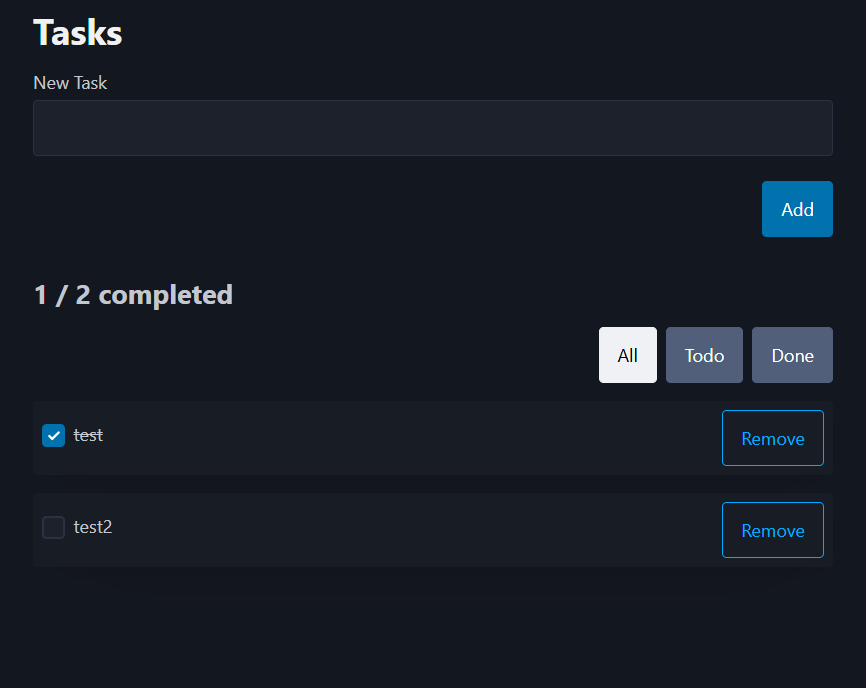

# This repo contains different Vue courses im doing.

### `Course_1`: 
[Modern Vue.js Crash Course 2025 | with TypeScript + script setup + Composition API](https://www.youtube.com/watch?v=5oKpoqmUj64)

### `Course_2`:
[Complete course Vue JS 3, Vuetify, Pinia, Vue Router & more](https://www.udemy.com/course/learn-vue3)